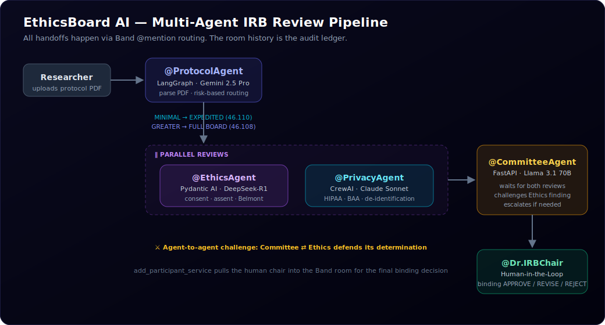

# EthicsBoard AI

### Regulated Multi-Agent IRB Review Platform
**Built for the Band of Agents Hackathon (Track 3: Regulated & High-Stakes Workflows)**

<p>
  <a href="https://github.com/Malikasadjaved/ethicsboard-ai/actions/workflows/ci.yml"></a>
  
  
  
  
  
  
  
</p>

EthicsBoard AI is an automated Institutional Review Board (IRB) review pipeline powered by cooperative agents. It accelerates human clinical trial protocols from weeks to minutes while enforcing strict compliance and regulatory audit trails.

<p align="center">
  
</p>

---

## 📸 Screenshots

<!--
  Live dashboard captures live in docs/. Drop the PNGs in and they'll render here:
  docs/dashboard.png      — full pipeline view (agent cards + deficiencies)
  docs/review-feed.png    — Band Room live review feed
-->
> The live Next.js dashboard streams the Band room in real time — agent status cards,
> the non-linear pipeline tracker, the live message feed, and the detected-deficiency
> panel with regulatory citations. _(Add `docs/dashboard.png` and `docs/review-feed.png` to embed captures here.)_

---

## 🚀 Key Features

* **4 Specialist Agents**:
  1. **@ProtocolAgent** (Gemini 2.5 Pro via Google AI SDK) — Parses protocol PDFs and extracts structured metadata.
  2. **@EthicsAgent** (DeepSeek-R1 via Featherless AI) — Evaluates ethical compliance (assent, disclosures, consent forms).
  3. **@PrivacyAgent** (Claude 3.5 Sonnet via AI/ML API) — Assesses HIPAA data governance, access controls, and retention.
  4. **@CommitteeAgent** (Llama 3.1 70B via Featherless AI) — Aggregates findings and acts as the Human-in-the-Loop (HITL) coordinator.
* **Band as the Audit Ledger**: The agents share no direct APIs. All handoffs, analyses, and messages happen via `@mention` routing in a single, secure Band room. The room history is the immutable, legally mandated audit ledger. Unlike a traditional dashboard log, this history is owned by the Band platform — tamper-evident, sequential, and accessible to all review participants including the IRB Chair.
* **Risk-Based Review Routing**: ProtocolAgent's risk classification routes the workflow — MINIMAL RISK protocols enter the **EXPEDITED track** (45 CFR 46.110, designated-reviewer sign-off), while GREATER THAN MINIMAL protocols require **FULL BOARD review** (45 CFR 46.108). If specialists find deficiencies on an expedited protocol, the Committee **escalates it to full board** per 45 CFR 46.110(b).
* **Parallel Specialist Reviews**: Ethics and privacy reviews are independent, so ProtocolAgent dispatches both in a single message — `@EthicsAgent` and `@PrivacyAgent` review **concurrently**, and the CommitteeAgent waits until both findings land in the Band room before proceeding.
* **Agent-to-Agent Challenge**: Before convening the human chair, the CommitteeAgent **challenges the EthicsAgent** on its most severe finding — is it blocking, or resolvable via minor revisions under 45 CFR 46.110(b)(2)? The Ethics specialist must defend its determination in the room before the review advances.
* **Rigorous Regulatory Citations**: Automatically flags compliance issues against **45 CFR 46** (informed consent and minor assent) and **HIPAA 45 CFR 164** (Business Associate Agreements and de-identification standards).
* **Robust Model Coverage**: Powered by both **Featherless AI** (open-source reasoning models like DeepSeek-R1) and **AI/ML API** (Claude, Gemini, Llama) with smart fallback execution.
* **Human-in-the-Loop (HITL) Gate**: Integrates a real `add_participant_service` invocation to dynamically pull the human IRB Chair into the Band room for final binding approval.

---

## 🎭 The Problem

Every hospital, university, and pharmaceutical company must submit research involving human subjects to an **Institutional Review Board (IRB)** before any study can begin. The IRB must review the protocol for ethics compliance, informed consent validity, risk-benefit justification, and data privacy — then a qualified human chair must approve the decision.

Today this process takes **6 to 12 weeks** of manual back-and-forth across email chains. A single missing clause in a consent form restarts the clock. Patient studies get delayed. There is no structured handoff, no traceability, and no coordination layer.

**EthicsBoard AI** puts four specialist agents into a Band room with the research protocol. Each reviews from their domain. Deficiencies surface in hours. The IRB chair makes the only decision they are legally allowed to make. The Band room is the audit record.

---

## 📐 Architecture

```
Researcher
    │
    ▼
Band Chat Room: "IRB Review — Protocol #IRB-PEDI-2026-0047"
    │
    @ProtocolAgent              ← Google ADK + Gemini 2.5 Pro
        Parses protocol PDF, classifies risk level
        │
        ├─ MINIMAL RISK          → REVIEW TRACK: EXPEDITED  (45 CFR 46.110)
        └─ GREATER THAN MINIMAL  → REVIEW TRACK: FULL BOARD (45 CFR 46.108)
        │
        ▼  (single message mentions BOTH specialists — reviews run in PARALLEL)
    ┌───────────────────────────┬───────────────────────────┐
    │ @EthicsAgent              │ @PrivacyAgent             │
    │ ← Featherless (DeepSeek-R1)│ ← AI/ML API (Claude 3.5)  │
    │ Consent, Belmont, assent  │ HIPAA, BAA, retention,    │
    │ requirements              │ de-identification         │
    └─────────────┬─────────────┴─────────────┬─────────────┘
                  └───────────┬───────────────┘
                              ▼
    @CommitteeAgent             ← Featherless AI (Llama 3.1 70B) + Band HITL
        1. WAITS until BOTH parallel reviews land in the room
        2. CHALLENGES @EthicsAgent: "is your top finding blocking,
           or minor-revisable under 45 CFR 46.110(b)(2)?"
        3. @EthicsAgent defends its determination in the room
        4. EXPEDITED + deficiencies? → ESCALATES to FULL BOARD (46.110(b))
        5. add_participant → pulls human @Dr.IRBChair in for binding decision
```

All four agents communicate exclusively through Band's `@mention` routing. No agent has a direct API connection to another. The Band room conversation IS the legally required review record — including the agents' disagreement and its resolution.

---

## 💬 How It Works (Example Pipeline Handoffs)

### Step 1 — Protocol Submission
```
Researcher: @ProtocolAgent Please review this research protocol.
            [uploads: IRB_Protocol_PEDI-2026-0047.pdf]
```

### Step 2 — Protocol Analysis + Risk-Based Routing (Google ADK + Gemini 2.5 Pro)
ProtocolAgent parses the PDF, extracts structured fields, and **routes the review track** based on risk. Both specialists are dispatched **in parallel** — one message, two mentions:

```
ProtocolAgent: Protocol parsed.
               Study: Phase II RCT — MetaGlyX-400 in Pediatric T2DM
               Population: VULNERABLE (minors aged 8–16)
               RISK: GREATER THAN MINIMAL → REVIEW TRACK: FULL BOARD (45 CFR 46.108)

               Dispatching parallel specialist reviews:
               @EthicsAgent — please assess informed consent adequacy and risk-benefit ratio.
               @PrivacyAgent — please review data handling and HIPAA compliance.
```

> A MINIMAL RISK protocol would instead route to `REVIEW TRACK: EXPEDITED (45 CFR 46.110)` — eligible for designated-reviewer sign-off without convening the full board.

### Step 3 — Parallel Specialist Reviews (DeepSeek-R1 ∥ Claude 3.5 Sonnet)
Ethics and privacy reviews are independent, so they run **concurrently**. Each posts findings to the room and hands off to the Committee — in whichever order they finish:

```
EthicsAgent:  ETHICS REVIEW FINDINGS — DEFICIENCIES FOUND
              1. Written assent form absent for ages 12–16 (45 CFR 46.408)
              2. Hepatic monitoring not disclosed in consent (ICH E6(R2) 4.8.10)
              @CommitteeAgent — ethics review complete.

PrivacyAgent: PRIVACY REVIEW FINDINGS — CONDITIONAL PASS WITH GAPS
              CRITICAL GAP: BioSync Research CRO data sharing has no executed
              BAA (HIPAA 45 CFR 164.308(b)(1)).
              @CommitteeAgent — privacy review complete.
```

The CommitteeAgent **waits** until *both* reviews are present in the Band room before acting — if only one has landed, it holds.

### Step 4 — Agent-to-Agent Challenge (Committee → Ethics)
Before convening the human chair, the CommitteeAgent **challenges** the Ethics specialist on its most severe finding — genuine inter-agent review, not a relay:

```
CommitteeAgent: CLARIFICATION REQUEST
                @EthicsAgent — your most severe finding: Missing Written
                Assent (45 CFR 46.408). Does this constitute a blocking
                deficiency requiring full convened-board deliberation, or
                can it be resolved through minor revisions under expedited
                handling (45 CFR 46.110(b)(2))?

EthicsAgent:    CLARIFICATION RESPONSE
                Determination: BLOCKING. The absence of a written assent
                process alters the consent framework for a vulnerable
                population — not resolvable as a minor revision.
                @CommitteeAgent — clarification provided.
```

> If the protocol was on the EXPEDITED track and deficiencies were found, the Committee **escalates it to FULL BOARD** per 45 CFR 46.110(b) — the escalation is recorded in the room.

### Step 5 — Committee Coordination + HITL (Featherless AI / Llama 3.1 70B + Band)
CommitteeAgent aggregates all findings. It cannot issue a determination to the researcher without human IRB chair approval — this is legally mandated, not optional. CommitteeAgent dynamically adds the IRB chair to the Band room using `add_participant_service`.

```
CommitteeAgent: [Adds @Dr.IRBChair to Band room]

                Dr. IRBChair — Full Board review required.

                FINDINGS SUMMARY:
                ├── Ethics: 2 deficiencies (assent form, hepatic
                │          disclosure missing from consent)
                └── Privacy: 1 gap (BAA for CRO data sharing absent)

                Protocol cannot proceed until deficiencies resolved.
                Please confirm decision: APPROVE / REQUEST REVISIONS
                / REJECT

Dr.IRBChair:    Request Revisions. Researcher must submit:
                (1) Written assent form for ages 12–16
                (2) Hepatic monitoring disclosure added to consent
                (3) Executed BAA with BioSync Research

CommitteeAgent: Decision recorded and timestamped.
                Generating official IRB determination letter.
                Complete review record preserved in Band room.
```

The entire Band room conversation — every agent's reasoning, every finding, every timestamp, the human decision — is the IRB review record. Regulators require exactly this.

---

## 🛠️ Tech Stack & Coverage

* **Agent Coordination**: [Band SDK](https://app.band.ai/) (Mentions, channel subscriptions, dynamic add participant)
* **AI/ML API**: Claude 3.5 Sonnet, Gemini 2.5 Pro, Llama 3.3
* **Featherless AI**: DeepSeek-R1-Distill-Llama-70B, Llama-3.1-70B-Instruct
* **Backend**: FastAPI, WebSockets
* **Frontend**: Next.js (TypeScript), Tailwind CSS
* **Document Processing**: `pdfplumber`

---

## 📂 Project Structure

```
ethicsboard-ai/
├── agents/
│   ├── protocol_agent/
│   │   └── agent.py              # Google ADK + Gemini agent definition
│   ├── ethics_agent/
│   │   └── agent.py              # Featherless AI DeepSeek-R1 agent
│   ├── privacy_agent/
│   │   └── agent.py              # AI/ML API Claude agent
│   ├── committee_agent/
│   │   └── agent.py              # Featherless AI Llama 3.1 70B agent
│   ├── agent_runners.py          # Band Room agents runner registry
│   ├── band_client.py            # Band Platform SDK client wrapper
│   └── llm_utils.py              # LLM caller utilities with retries
│
├── backend/
│   └── server.py                 # FastAPI backend server & WebSocket manager
│
├── demo/
│   └── IRB_Protocol_PEDI-2026-0047.pdf   # Demo protocol (planted deficiencies)
│
├── frontend/
│   ├── src/
│   │   ├── app/
│   │   │   ├── page.tsx          # Dashboard UI
│   │   │   ├── globals.css       # Styling
│   │   │   └── layout.tsx        # Next.js layout configuration
│   │   └── components/           # React component layer (AgentCard, MessageFeed, etc.)
│   └── package.json
│
├── agent_config.yaml.example     # Template for agent credentials configuration
├── test_backend.py               # E2E integration test suite
├── docker-compose.yml            # Containerized launch config
├── .env.example
└── README.md
```

---

## 🏃 Quick Start

### Fastest path — Docker Compose
Once your `.env` and `agent_config.yaml` are in place (see step 1 below), the whole
stack comes up with one command:
```bash
docker-compose up --build
```
Backend on `:8008`, frontend on `:3000`. To run the services manually instead, follow
the steps below.

### 1. Configure Environment Variables
Copy `.env.example` to `.env` and fill in the values:
```env
# Band SDK Credentials
THENVOI_REST_URL=https://app.band.ai
THENVOI_WS_URL=wss://app.band.ai/api/v1/socket/websocket

# IRB Chair ID
BAND_IRB_CHAIR_USER_ID=<your_band_user_uuid>

# API Providers
AIML_API_KEY=<your_aimlapi_key>
FEATHERLESS_API_KEY=<your_featherless_key>

# Application Configuration
API_PORT=8008
TEST_MODE=false
```

Create your `agent_config.yaml` file referencing each agent's UUID and Band API keys as registered in the Band platform.

### 2. Run the Backend Server
```bash
# Setup virtual environment
python -m venv .venv
source .venv/bin/activate  # On Windows: .venv\Scripts\activate

# Install dependencies and start server
pip install -r requirements.txt
python backend/server.py
```

### 3. Run the Frontend Dashboard
```bash
cd frontend
npm install
npm run dev
```
Open `http://localhost:3000` to interact with the Next.js visual dashboard.

### 4. Run the E2E Integration Suite
To run the automated test pipeline which simulates the entire agent chain, uploads a sample protocol, and posts a simulated IRB Chair decision:
```bash
# Ensure TEST_MODE=true is configured in your .env
python test_backend.py
```

---

## ⚖️ The Deficiencies (Planted for Demo)

The sample protocol included in [demo/IRB_Protocol_PEDI-2026-0047.pdf](demo/IRB_Protocol_PEDI-2026-0047.pdf) contains three deliberate, compliance-violating deficiencies:

| # | Location | Deficiency | Regulatory Basis |
|---|---|---|---|
| 1 | Section 5.2 | No written assent form for participants aged 12–16 | 45 CFR 46.408 |
| 2 | Section 5.2 | Long-term hepatic monitoring not disclosed in consent despite being in risk table | ICH E6(R2) 4.8.10 |
| 3 | Section 6.3 | CRO (BioSync Research) data sharing not covered by Business Associate Agreement | HIPAA 45 CFR 164.308(b)(1) |

---

## 🏆 Hackathon Track

**Track 3: Regulated & High-Stakes Workflows**

EthicsBoard AI coordinates four distinct agents across four separate model endpoints (Claude, DeepSeek, Gemini, Llama) using the **Band** platform as a secure messaging bus. The workflow is genuinely non-linear: risk classification routes protocols between expedited and full-board tracks, specialist reviews run in parallel with the Committee synchronizing on both, agents challenge each other's findings before decisions are made, and expedited reviews escalate to full board when deficiencies surface. By capturing the conversation history — including inter-agent disagreement and its resolution — enforcing an authorized human-in-the-loop sign-off, and utilizing real `add_participant_service` actions, the system serves as a production-grade regulatory review record.

---

## 👥 Team
Built for the Band of Agents Hackathon · June 12–19, 2026

**Asad Javed** — Agent architecture, Google ADK, FastAPI, Band integration, demo narrative
* Founder, Premium Logic · AI Engineer
* [LinkedIn](https://linkedin.com/in/malikasadjaved) · [GitHub](https://github.com/Malikasadjaved)

---

## 📄 License
MIT License — see LICENSE for details.

---

> *"A pediatric drug trial delayed by 10 weeks because an IRB reviewer missed a consent form clause. That is not a documentation problem — it is a coordination problem. EthicsBoard AI is the coordination layer."*
